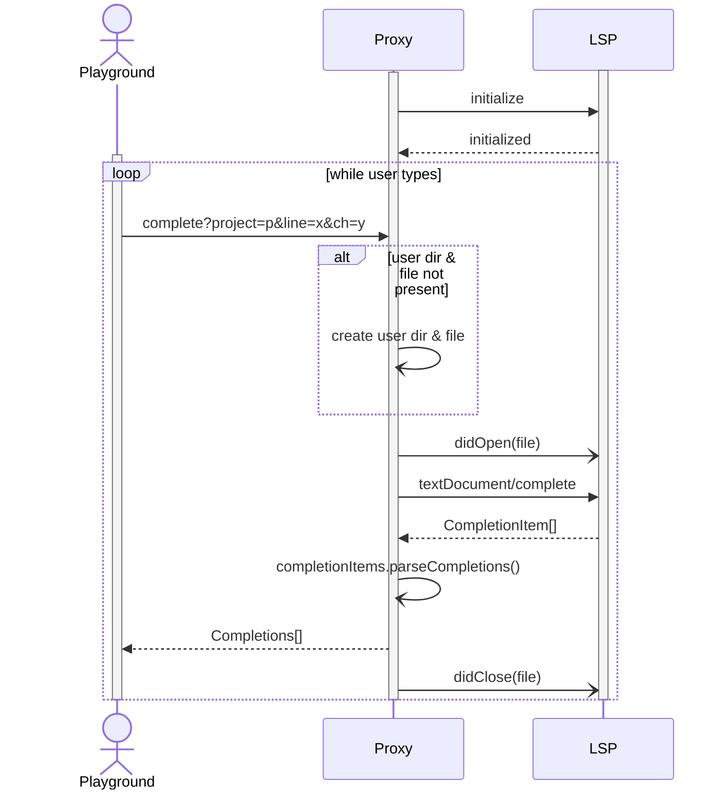

```mermaid
sequenceDiagram
        actor Playground
        participant Proxy
        participant LSP
        
        activate LSP
        activate Proxy

        Proxy ->> LSP: initialize
        LSP -->> Proxy: initialized

        activate Playground
        loop while user types
            Playground ->> Proxy: complete?project=p&line=x&ch=y

            alt user dir & file not present
                Proxy -) Proxy: create user dir & file
            end

        
            Proxy -) LSP: didOpen(file)
            Proxy ->> LSP: textDocument/complete
            LSP -->> Proxy: CompletionItem[]
            Proxy -) Proxy: completionItems.parseCompletions()
            Proxy -->> Playground: Completions[]
            Proxy -) LSP: didClose(file)
        end
        deactivate Playground

        deactivate LSP
        deactivate Proxy
```
