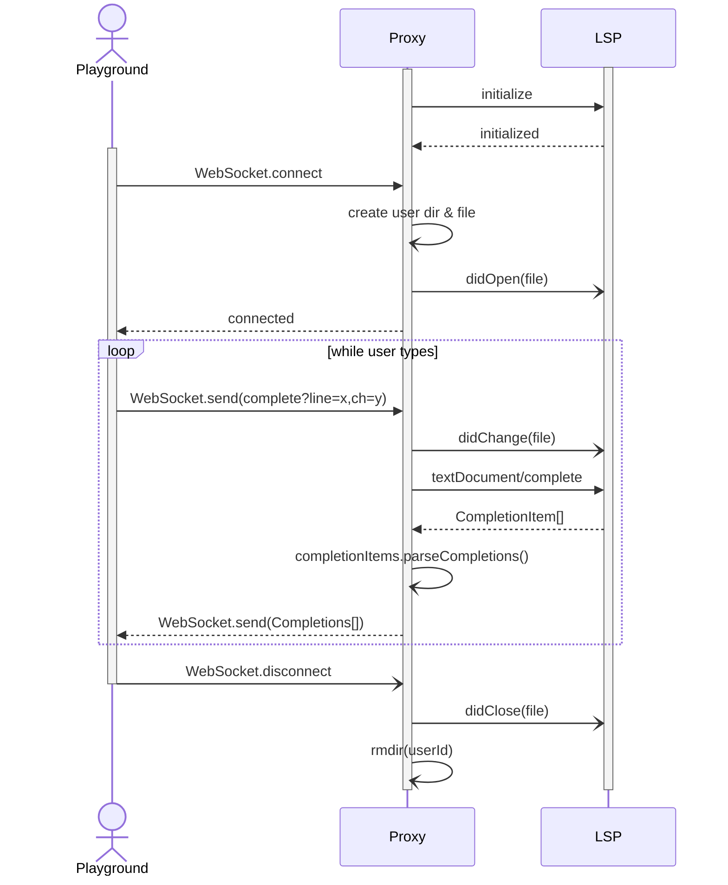

```mermaid
sequenceDiagram
        actor Playground
        participant Proxy
        participant LSP
        
        activate LSP
        activate Proxy

        Proxy ->> LSP: initialize
        LSP -->> Proxy: initialized

        activate Playground
        Playground ->> Proxy: WebSocket.connect
        Proxy -) Proxy: create user dir & file
        Proxy -) LSP: didOpen(file)
        Proxy -->> Playground: connected

        loop while user types
            Playground ->> Proxy: WebSocket.send(complete?line=x,ch=y)
            Proxy -) LSP: didChange(file)
            Proxy ->> LSP: textDocument/complete
            LSP -->> Proxy: CompletionItem[]
            Proxy -) Proxy: completionItems.parseCompletions()
            Proxy -->> Playground: WebSocket.send(Completions[])
        end

        Playground -) Proxy: WebSocket.disconnect
        deactivate Playground

        Proxy -) LSP: didClose(file)
        Proxy -) Proxy: rmdir(userId)


        deactivate LSP
        deactivate Proxy
```
